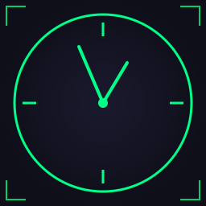

<p align="center">
  
</p>

# Download HudClock

## Latest Release

Download the latest version of HudClock from our [GitHub Releases page](https://github.com/lionfire/hudclock/releases).

## System Requirements

- Windows 10 or later
- .NET 8.0 Runtime (installer will prompt if not installed)

## Installation

1. Download the latest release ZIP file
2. Extract to your preferred location
3. Run `HudClock.exe`

## Building from Source

If you prefer to build HudClock yourself:

```bash
git clone https://github.com/lionfire/hudclock.git
cd hudclock/src/wpf
dotnet build
dotnet run
```

### Prerequisites for Building
- .NET 8.0 SDK
- Visual Studio 2022 or VS Code (optional)

## First Run

On first launch, HudClock will:
1. Display in analog mode at the center of your screen
2. Create settings in `%APPDATA%/HudClock/`
3. Show the settings window (right-click the clock)

## Quick Start

- **Move**: Click and drag the clock
- **Resize**: Drag the corner grip
- **Settings**: Right-click the clock
- **Click-through Mode**: Ctrl+Shift+C
- **Exit**: Right-click → Exit

[Back to Home](index.md)